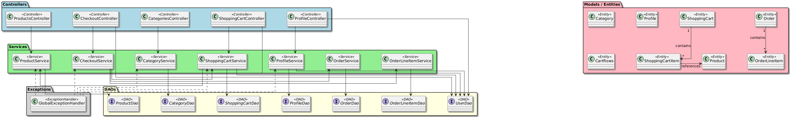

# 🛒 E-Commerce Backend (E2E Capstone Project)

## 🚀 Project Overview
This is a **full-featured, end-to-end (E2E) e-commerce backend** built with **Spring Boot**.  
It supports users, profiles, shopping carts, products, categories, and checkout workflows.

The backend demonstrates:
- **End-to-End workflows:** from shopping cart creation → checkout → order creation → cart cleanup.
- **RESTful API design** with proper HTTP status codes.
- **Exception handling** and validation layers.
- **Role-based access control** (Admin/User) using Spring Security.
- **Service-oriented architecture**, modular and production-ready.

I built on top of a pre-existing Spring Boot framework, extending it with advanced features, validation, and orchestration for realistic e-commerce scenarios.

---

## 🎯 Key Features
- **User Profiles**: Secure CRUD operations, email uniqueness validation, and role-based access.
- **Products & Categories**: Full management with search, filtering, and update/delete capabilities.
- **Shopping Cart**: Add/update/delete items, with quantity validation.
- **Checkout System**: Orchestrates multiple services in one transaction:  
  `ShoppingCartService → OrderService → OrderLineItemService → Cart cleanup`
- **Centralized Exception Handling**: Handles not-found, validation, and business rule errors consistently.
- **Integration Ready**: Swagger UI and Postman collections for testing and frontend collaboration.

---

## 📁 Project Structure

```text
ecommerce-backend/
├── src/
│   ├── main/
│   │   ├── java/org/yearup/
│   │   │   ├── controllers/
│   │   │   │   ├── CheckoutController.java
│   │   │   │   ├── ProductController.java
│   │   │   │   ├── ProfileController.java
│   │   │   │   ├── CategoryController.java
│   │   │   │   └── ShoppingCartController.java
│   │   │   ├── dao/
│   │   │   │   ├── UserDao.java
│   │   │   │   ├── ProductDao.java
│   │   │   │   ├── ProfileDao.java
│   │   │   │   ├── ShoppingCartDao.java
│   │   │   │   ├── CategoryDao.java
│   │   │   │   └── OrderDao.java
│   │   │   ├── models/
│   │   │   │   ├── Product.java
│   │   │   │   ├── Profile.java
│   │   │   │   ├── ShoppingCart.java
│   │   │   │   ├── ShoppingCartItem.java
│   │   │   │   ├── Order.java
│   │   │   │   ├── OrderLineItem.java
│   │   │   │   ├── Category.java
│   │   │   │   └── CartRows.java
│   │   │   ├── service/
│   │   │   │   ├── CheckoutService.java
│   │   │   │   ├── ShoppingCartService.java
│   │   │   │   ├── ProductService.java
│   │   │   │   ├── ProfileService.java
│   │   │   │   ├── OrderService.java
│   │   │   │   ├── OrderLineItemService.java
│   │   │   │   └── CategoryService.java
│   │   │   └── exception/
│   │   │       ├── GlobalExceptionHandler.java
│   │   │       ├── ProductNotFoundException.java
│   │   │       ├── ShoppingCartNotFoundException.java
│   │   │       ├── EmailAlreadyExitsException.java
│   │   │       ├── EmptyCartException.java
│   │   │       ├── InvalidSearchCriteriaException.java
│   │   │       ├── ProductNotFoundInCartException.java
│   │   │       └── InvalidQuantityAmountException.java
│   │   └── resources/
│   │       └── application.properties
└── pom.xml
```


## 💡 Impressive / Interesting Code Snippets

### Checkout Service Orchestration
The `CheckoutService` **coordinates multiple services** to perform checkout in one call:

```java
public CheckoutRespondDto checkout(int userId){
    ShoppingCart shoppingCart = shoppingCartService.getShoppingCartByUserId(userId);
    if(shoppingCart.getItems().isEmpty()){
        throw new EmptyCartException("Cart is empty: " + userId);
    }
    Order order = orderService.create(userId);
    List<OrderLineItem> orderLineItemList = orderLineItemService.create(shoppingCart, order.getOrderId());
    shoppingCartService.delete(userId);
    return new CheckoutRespondDto(order, orderLineItemList);
}

```

## 🛠 Centralized Exception Handling

All exceptions are handled in one place using `@RestControllerAdvice`:

```java
@ExceptionHandler(ProductNotFoundException.class)
public ResponseEntity<Map<String, String>> handleProductNotFound(ProductNotFoundException ex){
    Map<String, String> errors = new HashMap<>();
    errors.put("message", "Product not found");
    return ResponseEntity.status(HttpStatus.NOT_FOUND).body(errors);
}
```
✅ Simplifies debugging and provides consistent API responses.

## 💡 Advanced Validations

Profile updates and product management include custom validation:

```java
if(profileDao.existsByEmail(profile.getEmail())){
    throw new EmailAlreadyExitsException("Email already exists: " + profile.getEmail());
} 
```
✅ Prevents duplicate emails and enforces business rules.

## 🏗 Architecture

- **Controllers** handle HTTP requests and delegate to services.
- **Services** encapsulate business logic.
- **DAOs** manage database operations.
- **Models** represent entities and support validation.
- **GlobalExceptionHandler** ensures consistent error handling.



## 🏆 What’s Impressive

- End-to-End workflow: Checkout service handles multiple steps atomically.
- Comprehensive exception handling with meaningful HTTP status codes.
- Role-based access control for Admin/User using Spring Security annotations (@PreAuthorize).
- Clean and modular architecture, easy to extend or maintain.
- Integration Ready: Swagger and Postman for API exploration and testing.


## 💻 How I Worked on This

- Extended pre-built Spring Boot code to include advanced cart, checkout, and profile features.
- Added validation, exception handling, and role-based security.
- Refactored code to be clean, maintainable, and production-ready.
- Focused on realistic e-commerce workflows and engineering best practices.

## 🧪 Testing & API Documentation

### Postman Tests
I created **Postman collections** to test all endpoints of the backend, including:
- CRUD operations for **Products**, **Profiles**, and **Categories**
- Shopping cart operations: add, update, delete items
- Checkout workflows
- Error scenarios (empty cart, invalid product, duplicate emails, etc.)

✅ Ensures all endpoints behave as expected and edge cases are covered.

### Swagger Integration
The project includes **Swagger UI** for API documentation:
- Provides a live, interactive interface for testing endpoints
- Displays models, request parameters, and response formats
- Makes it easy for frontend developers or QA engineers to explore the API

You can access Swagger at:  
`http://localhost:8080/swagger-ui/index.html` (when running the backend locally)

✅ Improves collaboration and reduces API miscommunication.


## 🔑 Technologies

- Java 17
- Spring Boot
- Spring Security
- RESTful APIs
- Validation & Exception Handling
- MySQL 
